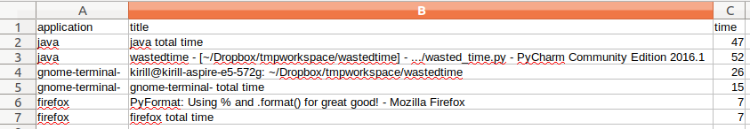

# wasted_time
## About
Application records time which was spent on each window.

## Example


### 1. Install requirements
**Note:** tested with Python 3+
#### Mac
```bash
python -m pip install -r requirements/mac.txt
```

#### Linux
```bash
python -m pip install -r requirements/linux.txt
sudo apt install -y xdotool
```
#### Windows
```bash
python -m pip install -r requirements/win.txt
```

### 2. Run wasted_time
#### 2.1 Record time
```bash
python wasted_time.py
```
#### 2.2 Merge recorded time into one
```bash
python wasted_time.py -m -i <path_to_folder_with_csvs>
```
